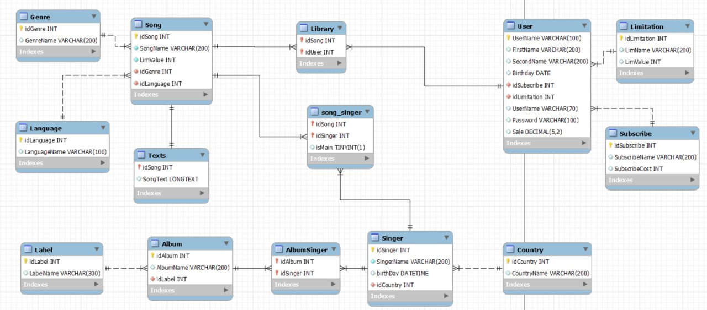

# Spring Project

## This is my spring project that implements work of smart speaker. This program works with DB.
 

-------

### Model of database

#### In this model type ***TUNYINT*** is ***BOOLEAN***

## Architecture of application: 
* #### Spring MVC 
* #### Thymeleaf
* #### Spring Security
* #### PostgreSQL
* #### Hibernate
* #### Jackson

####

## Useful links

* Frontend [LINK1](https://daisyui.com/components/stat/)
* Frontend [LINK2](https://tailwindcss.com/docs/divide-width)
* Spring security [LINK1](https://www.javaguides.net/2022/08/spring-security-without-webSecurityconfigureradapter.html)
* Spring [LINK1](https://www.javaguides.net/2018/10/user-registration-module-using-springboot-springmvc-springsecurity-hibernate5-thymeleaf-mysql.html)

###

### During developing application i had problems and i attach some problem and link to solve this problem:

* My default db didn't support Russian letters. I find solve [here](https://stackoverflow.com/questions/56559216/search-is-not-working-with-lowercase-like-for-russian-characters);

#

### Problems that haven't been solved yet:
*  Songs in templates doesn't allow scroll and set time

